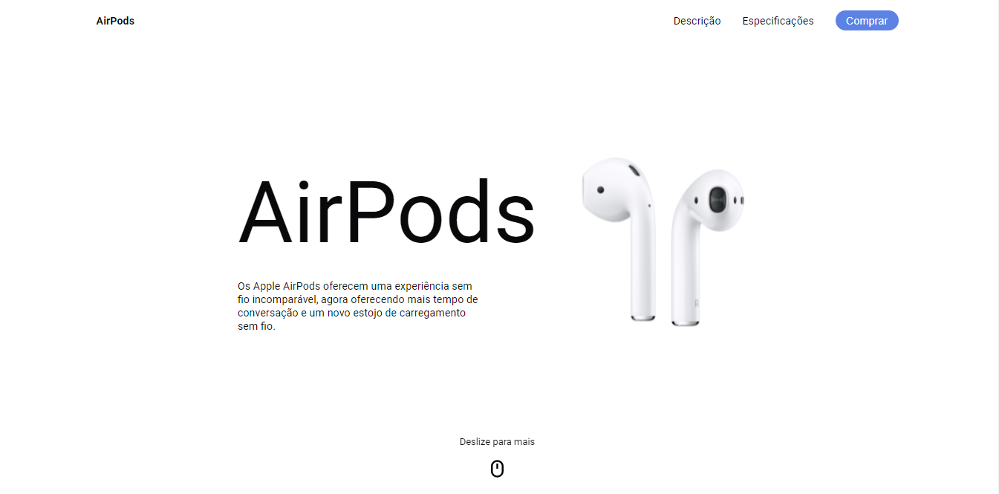

<h1 align="center">
  AirPods | Landing Page
</h1>

<h4 align="center">
  AirPods Landing Page responsiva e animada com HTML, CSS e JavaScript.
</h4>

<h4 align="center"><a href="https://airpods.vercel.app">Clique para visitar o projeto</a></h4>

---

## 🧪 Tecnologias utilizadas

Para o desenvolvimento deste site utilizei as seguintes tecnologias:

- HTML;
- CSS;
- JavaScript;

Bibliotecas

- [Google Fonts](https://fonts.google.com)
- [GSAP](https://greensock.com/gsap/)
- [ScrollMagic](https://scrollmagic.io/)

---

## 📝 Licença

Esse projeto está sob licença. Veja o arquivo [LICENÇA](LICENSE.md) para mais detalhes.

---

Desenvolvido por Deivit Eduardo 🚀
